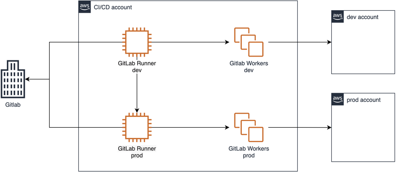
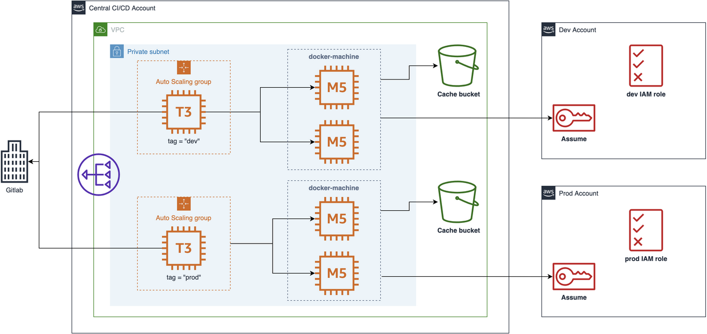
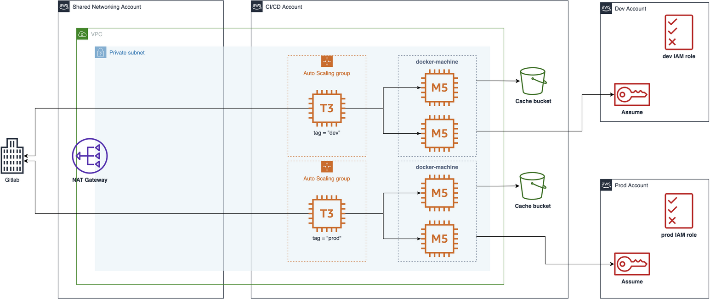
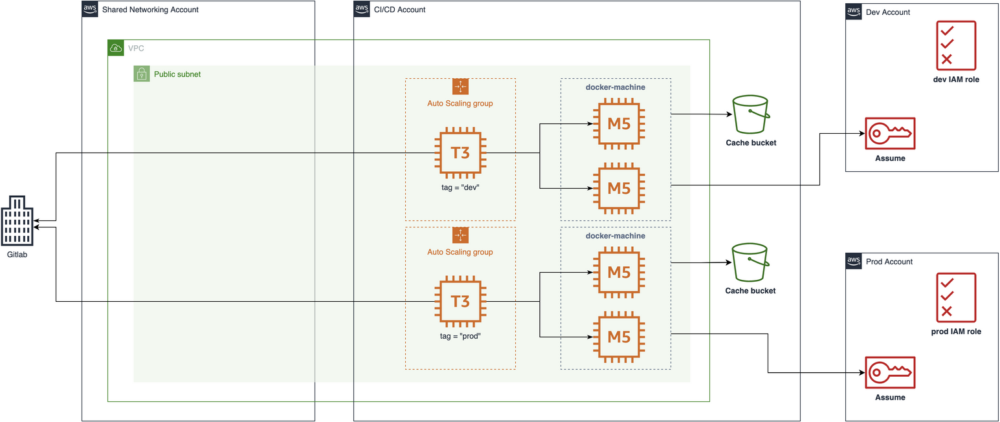

# Gitlab CI/CD custom runners with Terraform

## Background

As the number of AWS Accounts grows to isolate production from non-production environments, CI/CD pipelines can become challenging to maintain and secure in a centralized fashion. Costs can also increase when different teams might require more processing power than others. This can lead to higher costs and overly permissive resources due to the nature of shared infrastructure.

This sample Terraform module automates the creation and isolation of self-hosted [GitLab Runners][gitlab-runner] per environment on AWS. These runners are pre-configured to run pipeline stages [tagged][gitlab-tags] as `dev` or `prod` in separate [GitLab Executors][gitlab-executors] (Workers). Lastly, these workers use scoped temporary credentials to deploy to their respective production or development environments hosted in separate AWS accounts.



> **Note**. You can find more information about the execution flow between pipelines, runners and executors in the [GitLab documentation][gitlab-runner-execution-sequence].


## Requirements

Before you deploy, you must obtain a GitLab Runner registration token under **Settings > CI/CD > Runners section** within your GitLab project. This will allow the runner to self-register with your project as a runner.

## Project structure

**`runner`**. Shared Gitlab CI/CD runner terraform module. You can customize any Runner configuration related to the underlying infrastructure such as EC2 Spot Instance type, bid price, pre-build script, and more. 

By default, we deny all incoming traffic to GitLab Runner instances. Workers only accept inbound traffic coming from their respective dev and prod Runners.

**`simple`**. Example of how to use the `runner` module in the context of a central account.

**`shared_networking`**. Example of how to use the `runner` module in the context of a shared networking architecture between multiple accounts.

**`.gitlab-ci.yml`**. Sample CI/CD pipeline using `dev` and `prod` tags. 

## Implementations

This example module can be used in two ways: [Centralized runners in a single account](#runners-in-a-single-account), or [Distributed runners using a shared VPC subnet](#distributed-runners-with-a-shared-subnet).

### Runners in a single account

This approach favours running multiple copies of the `runner` module per product team in a single account, where a central team is responsible for tuning them separately as needed.

**Pros.** Keep existing centralized model with reduced security blast radius as each copy only access a set of accounts. It's simpler to setup to support a handful of accounts.

**Cons.** AWS quotas has to be monitored and increased when possible, as all runners share a single account. It also requires additional communication cycles to tune each runner per team when necessary.



#### Requirement

You'll need 3 AWS Accounts: **CI/CD**, **Development**, and **Production**.

**CI/CD account**. The main account this sample will be deployed. It'll create a new dedicated VPC to run Dev and Prod GitLab Runners and Workers.

**Development account**. Simulates a Dev AWS account. Dev GitLab workers will connect to this account as it receives any pipeline job [tagged as dev][gitlab-tags].

**Production account**. Simulates a Prod AWS account. Prod GitLab workers will connect to this account as it receives any pipeline job [tagged as prod][gitlab-tags].

#### Deployment

Runners can run either on private subnets with a NAT gateway, or on public subnets.

**Deploying Runners in private subnets with a NAT gateway**

```bash
$ cd simple
$ terraform apply \
    -var registration_token=<gitlab registration token> \
    -var dev_profile=<dev aws profile name> \
    -var prod_profile=<prod aws profile name> \
    -var use_public_subnets=false
```

**Deploying Runners in public subnets with an Internet Gateway**

```bash
$ cd simple
$ terraform apply \
    -var registration_token=<gitlab registration token> \
    -var dev_profile=<dev aws profile name> \
    -var prod_profile=<prod aws profile name> \
    -var use_public_subnets=true
```

### Distributed runners with a shared subnet

This approach favours teams owning their CI Runner and Workers in a dedicated account while networking is centralized in a shared central account. This can scale to hundreds to up to a thousand accounts.

**Pros.** Keep each team responsible for their own quotas and CI Runners and Workers tuning when they need. It also helps implementing centralized security guardrails, and most importantly separate billing for CI Runners/Worker, or any inter-AZ traffic compared to networking resources like NAT Gateways, VPN, Transit Gateway, Direct Connect, etc.

**Cons.** Each product team will need an additional AWS account. A shared networking account also needs to be created and maintained in case there isn't one already.


**Example using private subnets with NAT Gateway**



**Example using public subnets instead**



#### Requirement

You'll need an AWS Organization setup and 4 accounts: **Shared Networking**, **CI/CD**, **Development**, and **Production**.

**Shared Networking account**. Owns networking gateways like VPC NAT Gateway, and selectively shares VPC Subnets across the Organization.

**CI/CD account**. The main account this sample will be deployed. It'll run on a VPC subnet shared by the shared networking account.

**Development account**. Simulates a Dev AWS account. Dev GitLab workers will connect to this account as it receives any pipeline job [tagged as dev][gitlab-tags].

**Production account**. Simulates a Prod AWS account. Prod GitLab workers will connect to this account as it receives any pipeline job [tagged as prod][gitlab-tags].

#### Deployment

Runners can run either on shared private subnets with a NAT gateway, or on shared public subnets. CI Runners and Workers appear and are billed in the application it is deployed while inbound and outbound networking traffic happens in the shared networking account.

**Deploying Runners in shared private subnets with a NAT gateway**

```bash
$ cd shared_networking
$ terraform apply \
    -var registration_token=<gitlab registration token> \
    -var cicd_profile=<cicd aws profile> \
    -var dev_profile=<dev aws profile> \
    -var prod_profile=<prod aws profile> \
    -var use_public_subnets=false
```

**Deploying Runners in shared public subnets with an Internet gateway**

```bash
$ cd shared_networking
$ terraform apply \
    -var registration_token=<gitlab registration token> \
    -var cicd_profile=<cicd aws profile> \
    -var dev_profile=<dev aws profile> \
    -var prod_profile=<prod aws profile> \
    -var use_public_subnets=true
```
## Security

See [CONTRIBUTING](CONTRIBUTING.md#security-issue-notifications) for more information.

## Additional resources

* [Article: Securely control VPC Sharing in a multi-account setup](https://aws.amazon.com/blogs/security/control-vpc-sharing-in-an-aws-multi-account-setup-with-service-control-policies/)
* [Docs: Shared VPC billing and metering](https://docs.aws.amazon.com/vpc/latest/userguide/vpc-sharing.html#vpc-share-billing)
* [Article: Key considerations for VPC Sharing and best practices](https://aws.amazon.com/blogs/networking-and-content-delivery/vpc-sharing-key-considerations-and-best-practices/)

[gitlab-runner]: https://docs.gitlab.com/runner/
[gitlab-executors]: https://docs.gitlab.com/runner/#executors
[gitlab-runner-execution-sequence]: https://docs.gitlab.com/runner/#runner-execution-flow
[gitlab-tags]: https://docs.gitlab.com/ee/topics/git/tags.html
[vpc-sharing-billing]: https://docs.aws.amazon.com/vpc/latest/userguide/vpc-sharing.html#vpc-share-billing

## License

This library is licensed under the MIT-0 License. See the LICENSE file.
